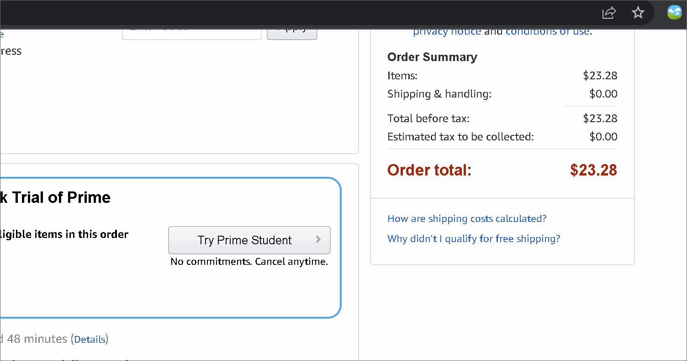

# WashU Hackathon2022
<ins>Team</ins>: Eric You, Vas Ramesh, Sanketh Gudapati, and Noah Li
  For Hack WashU, our team decided to create a chrome extension that fulfills the sustainability track while utilizing Mastercard's APIs
  <ins>Placement</ins>: <strong>First place</strong> for emerging division, <strong>Third place</strong> overall
 <ins>Devpost:</ins> https://devpost.com/software/master-tree

# About MasterTree
MasterTree is a chrome extension that uses Mastercard's Transaction Notification API and Priceless Planet Data Services API to enforce the idea that even donating the tiniest amount can have a large impact on the environment.

# How MasterTree Works
After a purchase has been made involving your Mastercard Card, the Mastercard Transaction Notification API will report that a transaction has been made and a chrome extension will activate a pop-up. This pop-up will alert the user that their recent purchase was X amount of money and will ask if they would like to round up to the nearest dollar. The difference will be donated and Mastercard's Priceless Planet Data Services API will display the amount of carbon sequestered and trees planted as a result of their donation. The user can choose to keep rounding up to whatever amount they'd like, increasing by a dollar everytime, and after they have decided what to round their donation towards, they will finalize their payment and their card will be charged accordingly.
  <ins> MasterTree in action: </ins>
 

# Files for MasterTree:
- <strong>PricelessPlanetAPIDemo folder:</strong> contains the java files that implement the Mastercard Priceless Plant Data Services API that returns a JSON formatted file
- <strong>manifest.json:</strong> holds all the information for constructing the google chrome extension
- <strong>images folder:</strong> contains the 16x16,48x48,&128x128px logos for the google chrome extension
- <strong>popup.html:</strong> main html file that is called from manifest.json. Front-end development for the popup (design)
- <strong>style.css:</strong> css file accompanying popup.html
- <strong>function.js:</strong> js file that performs DOM updates on popup.html and uses the JSON information printed from the local server in the java files which utilizes the Mastercard Priceless Planet Data Services API 
